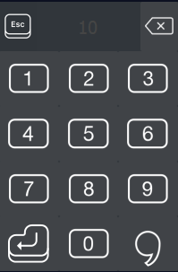
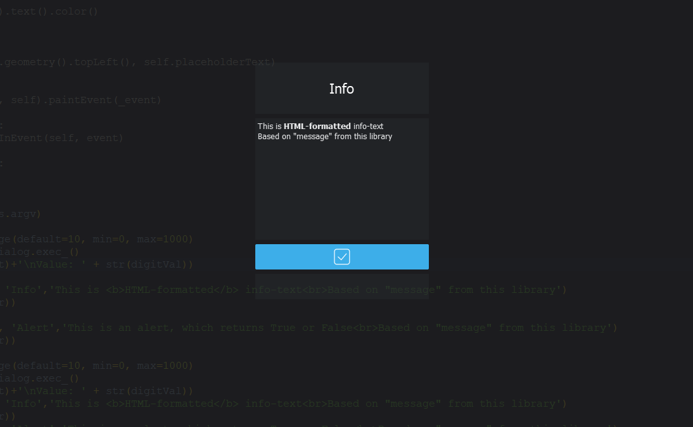
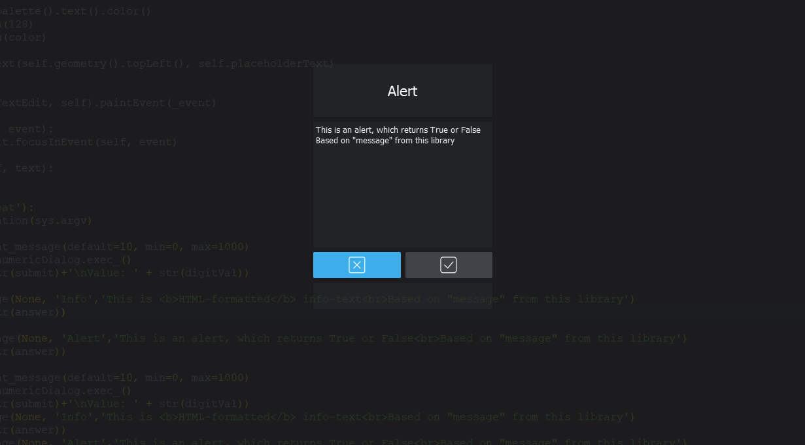
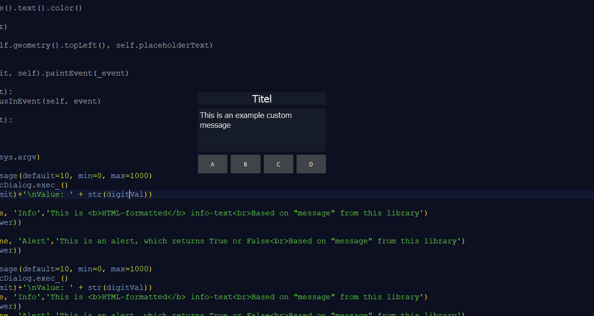

# PyQtTouchDialogs
A small library with QDialogs for PyQT optimized for touchscreens.

## Dependencies
> sudo pip3 install pyqt5

## Icons license
The icons are free for personal use and also free for commercial use, but Icons8 requires linking to their web site. Icons8 distributes them under the license called Creative Commons Attribution-NoDerivs 3.0 Unported. [Here is the link!](https://icons8.com) Thanks for making nice and free icons!

## Examples
> python3 touch_messages.py

## NumberInput

## Info dialog

## Alert dialog

## Custom dialog

